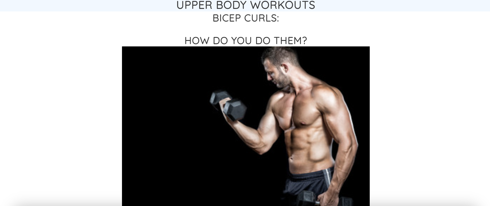
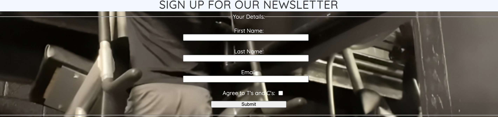

# Mindfitness #

Mindfitness is a website that documents workouts that can be performed both in the gym and in the home, with easy to follow steps and images. There is also information about the specific muscles that are targeted with each workout. 

The intention behind this website is to make working out easy to understand and access for all people, as working out increases a person's motivation, helps improve their mood, and makes them more aware and in tune with themselves, hence the name. 

This website targets those who may be new to working out and need ideas, or those who are looking for ways to be more mindful.

At the moment there are three workouts documented on each page, however there are plans to increase the amount and range of workouts documented.

## Features ##
### Navigation ###

- Above is an image of the navigation bar. This bar is at the top of every webpage.
- The navigation bar provides the links to each page and what they contain.
- There is a link to the home page, for returning from other pages.
- There are links to the other pages on the site, such as Upperbody, Lowerbody and Signup. These links are all located on the top right hand side.
- On the top left hand side of the navigation bar, you will find the site header, which is also a link back to the home page. Beneath the header, there is a lesser header which is the slogan for the website.

- Above is an image of the cover text displayed on the home page.
- The cover text gives a brief explanation about the website and it's purpose. 
- I plan to increase the information provided about mindfulness, either within the home page itself or on a seperate designated page.

- Above is an image of the footer bar and social media links with icons, which is found at the bottom of every web page.
- These icons were taken from [fontawesome.com](https://fontawesome.com/search?q=smile&o=r&m=free)
- On clicking the icons, the user will be taken to the corresponding social media site, which will open in a new browser tab. There is alt text provided for those users with accessibility needs.

### Upperbody Page Features ###

- Above are sreenshots from the upperbody page, explaining how to perform the workout, with images included, and the muscles that are targeted.
- There are two more workouts within the upperbody page, documenting how to perform the workout, and which muscles they target.
- The upperbody page also includes the navigation bar, the header and the footer section and social media links, as shown above.
- I plan to expand on this page by adding more workouts as well as their descriptions.

### Lowerbody Page Features ###

- Above are sreenshots from the lowerbody page, explaining how to perform the workout, with images included, and the muscles that are targeted, similar to the upperbody page.
- There are two more workouts within the lowerbody page, documenting how to perform the workout, and which muscles they target.
- The lowerbody page also includes the navigation bar, the header and the footer section and social media links, as shown above.
- I plan to expand on this page by adding more workouts as well as their descriptions.

### Signup Page Features ###

- Above is a screenshot of the form element in the signup page.
- The form includes a fieldset stating that this is where the user enters their details. The details being: their first name, last name,  and email address.
- There is also a checkbox to confirm agreement to terms and conditions, and a submit button.

- Above is a screenshot of the Contact section in the signup page.
- This section includes a phone number and email by which users can contact regarding features of the page, and questions or suggestions.

- Similar to the other pages, the sign up page also has the navigation bar, the header and the footer with social media icons and links

## Testing ##

- I have tested the website on Google Chrome and Safari.

- I have made sure that the website looks presentable, is functionable and responsive on different screen sizes using DevTools.

- I have made sure that all the content is readable and understandable.

- I have confirmed that all the links are working correctly, and that the form works correctly submits the information.

## Bugs ##

- I noticed that my navigation links and form labels and input fields did not have aria-labels, and made sure to correct this. 

- On testing my webpage by deploying via github-pages, i had found some bugs: I found that my navigation elements were not correctly linked to the relevant pages, so fixed that by adding the relative filepaths to the HREF attribute. I found that my social media links were not correctly linked, so corrected this by providing the correct URLs to the HREF attribute. I also found that my form was not submitting, so made sure to add an ACTION attribute and value to correct this.

## Validator Testing ##

### HTML ###
- I used the official W3C validator to validate my HTML code. 
- No errors were found in index.html 
- An incorrect image file name was found in upperbody.html. I corrected this by removing the space from the file name. This removed any errors.
- No errors were found in lowerbody.html.
- Some errors were found in signup.html. A screenshot has been added below.

### CSS ###

- I used the official Jigsaw W3 validator to validate my CSS code.
- No errors were found in the style.css file.

### Accessibility ###

- I used the lighthouse tool in DevTools to determine how accessible my website is. I recieved a score of 100%.

### Unfixed Bugs ###

- I was unable to resolve the bug found in signup.html via the W3C validator. This is because any changes made affected the styling of the page, and i was unable to locate the stray end tags. open elememts and unclosed element upon review.

## Deployment ##

- This website was deployed via Github-Pages. 

- I clicked 'settings' on the deployment page 
- clicked 'pages' in the Code and Automation section of the sidebar
- selected the main branch from the branch section, within build and deployment 
- selected the root folder 
- pressed save 

The live link for my website can be found [here](https://reemz1.github.io/Project1mindfitness/)

## Credits ##

### Code ###

- The HTML code for the navigation bar, dropdown menu, cover text and footer were taken from Code Institute's [Love Running Repository](https://github.com/Code-Institute-Solutions/love-running-v3.git)

- The CSS code for the asterisk wildcard selector, the body element, the header elements, the dropdown navigation bar, the menu within the dropdown navigation bar, the navigation toggle, the main content, the hero image, the cover text, the footer and the icons within the footer, were taken from Code Institute's [Love Running Repository](https://github.com/Code-Institute-Solutions/love-running-v3.git)

### Images ###

- The image depicting bicep curls on the upperbody page was taken from [stock.adobe.com](https://stock.adobe.com/images/id/70166543?clickref=1101lyb6wRp3&mv=affiliate&mv2=pz&as_camptype=&as_channel=affiliate&as_source=partnerize&as_campaign=wbm)

- The image depicting bent over rows on the upperbody page was taken from [stock.adobe.com](https://stock.adobe.com/uk/images/id/508577358?clickref=1100lyaCJrn2&mv=affiliate&mv2=pz&as_camptype=&as_channel=affiliate&as_source=partnerize&as_campaign=wbm)

- The image depicting dumbbell shoulder press on the upperbody page was taken from [stock.adobe.com](https://stock.adobe.com/images/id/126843544?clickref=1011lybrSC5I&mv=affiliate&mv2=pz&as_camptype=&as_channel=affiliate&as_source=partnerize&as_campaign=wbm)

- The image depicting squats on the lowerbody page was taken from [stock.adobe.com](https://stock.adobe.com/images/id/224023705?clickref=1011lybrScqY&mv=affiliate&mv2=pz&as_camptype=&as_channel=affiliate&as_source=partnerize&as_campaign=wbm)

- The image depicting lunges on the lowerbody page was taken from [stock.adobe.com](https://stock.adobe.com/images/id/80279947?clickref=1011lybrSg4b&mv=affiliate&mv2=pz&as_camptype=&as_channel=affiliate&as_source=partnerize&as_campaign=wbm)

- The image depicting hip thrusts on the lowerbody page was taken from [stock.adobe.com](https://stock.adobe.com/images/id/658724489?clickref=1011lybrSmiX&mv=affiliate&mv2=pz&as_camptype=&as_channel=affiliate&as_source=partnerize&as_campaign=wbm)

- These images were obtained via [pikwizard.com](https://pikwizard.com/)

### Icons ###

- The Favicon was taken from [pngtree.com](https://pngtree.com/element/down?id=NTMwNzgyNA==&type=1&time=1705344466&token=YTU2MzUxMjIyYzNmYjI3ODBkYjZjZTA5OGVhYzdmNGM=&t=0)

- The header icon was taken from [fontawesome.com](https://fontawesome.com/icons/dumbbell?f=classic&s=solid)

- The social media icon for Facebook was taken from [fontawesome.com](https://fontawesome.com/icons/twitter?f=brands&s=solid)

- The social media icon for Instagram was taken from [fontawesome.com](https://fontawesome.com/icons/instagram?f=brands&s=solid)

- The social media icon for Twitter was taken from [fontawesome.com](https://fontawesome.com/icons/twitter?f=brands&s=solid)

### Fonts ###

- The fonts were taken from [googlefonts.com](https://fonts.google.com/?query=quicksand)
