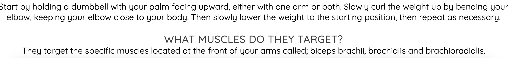

# Mindfitness #

Mindfitness is a website that documents workouts that can be performed both in the gym and in the home, with easy to follow steps and images. There is also information about the specific muscles that are targeted with each workout. 

The intention behind this website is to make working out easy to understand and access for all people, as working out increases a person's motivation, helps improve their mood, and makes them more aware and in tune with themselves, hence the name. 

This website targets those who may be new to working out and need ideas, or those who are looking for ways to be more mindful.

At the moment there are three workouts documented on each page, however there are plans to increase the amount of workouts and range of workouts documented.

## Features ##
### Navigation ###

- Above is an image of the navigation bar. This bar is at the top of every webpage.
- The navigation bar provides the links to each page and what they contain.
- There is a link to the home page, for returning from other pages.
- There are links to the other pages on the site, such as Upperbody, Lowerbody and Signup. These links are all located on the top right hand side.
- On the top left hand side of the navigation bar, you will find the site header, which is also a link back to the home page. Beneath the header, there is a lesser header which is the slogan for the website.

- Above is an image of the cover text displayed on the home page.
- The cover text gives a brief explanation about the website and it's purpose. 
- I plan to increase the information provided about mindfulness, either within the home page itself or on a seperate designated page.

- Above is an image of the footer bar and social media links with icons, which is found at the bottom of every web page.
- These icons were taken from [fontawesome.com](https://fontawesome.com/search?q=smile&o=r&m=free)
- On clicking the icons, the user will be taken to the corresponding social media site, which will open in a new browser tab. There is alt text provided for those users with accessibility needs.

### Upperbody Page Features ###

- Above are sreenshots from the upperbody page, explaining how to perform the workout, and the muscles that the workout targets, with images included.
- There are two more workouts within the upperbody page, documenting how to perform the workout, and which muscles they target.
- The upperbody page also includes the navigation bar, the header and the footer section and social media links, as shown above.
- I plan to expand on this page by adding more workouts as well as their descriptions.

### Lowerbody Page Features ###

- Above are sreenshots from the lowerbody page, explaining how to perform the workout, and the muscles that the workout targets, with images included, similar to the upperbody page.
- There are two more workouts within the lowerbody page, documenting how to perform the workout, and which muscles they target.
- The lowerbody page also includes the navigation bar, the header and the footer section and social media links, as shown above.
- I plan to expand on this page by adding more workouts as well as their descriptions.

### Signup Page Features ###

- Above is a screenshot of the form element in the signup page.
- The form includes a fieldset stating that this is where the user enters their details. The details being: their first name, last name,  and email address.
- There is also a checkbox to confirm agreement to terms and conditions, and a submit button.

- Above is a screenshot of the Contact section in the signup page.
- This section includes a phone number and email by which users can contact regarding features of the page, and questions or suggestions.

## Testing ##